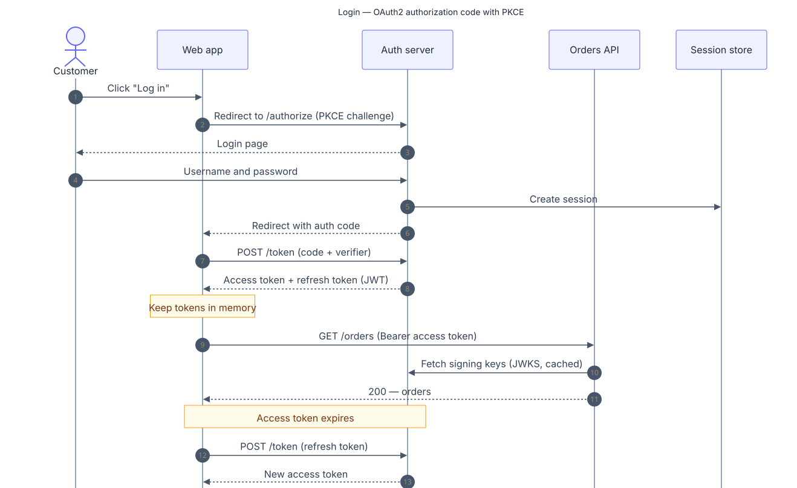
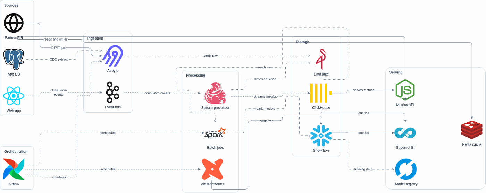

# custom-plugins

A small collection of [Claude Code](https://docs.claude.com/en/docs/claude-code) plugins for agentic
engineering. Each one is community-grade, MIT-licensed, and installable in a single command.

| Auth flow — Mermaid sequence | Data platform — draw.io, animated |
| :---: | :---: |
|  |  |

<sub>Built by [`architecture-diagrams`](plugins/architecture-diagrams): Mermaid for flows, draw.io for architecture.</sub>

## Install

Add the marketplace once, then install any plugin from it:

```bash
# in Claude Code
/plugin marketplace add hetekce/custom-plugins
/plugin install architecture-diagrams@custom-plugins
```

## Plugins

| Plugin | What it does |
| --- | --- |
| [`architecture-diagrams`](plugins/architecture-diagrams) | Turns a system description into clean diagrams — Mermaid for flows, draw.io for architecture (laid out by draw.io's own engine, with animated flow edges), plus a Gliffy export — with real tech-stack icons and copy that reads like a person wrote it. |

More will land here over time. Each plugin has its own README with usage and examples.

## Repository layout

```
.claude-plugin/marketplace.json   # the marketplace index
plugins/<name>/                    # one directory per plugin
docs/                              # shared authoring standards
scripts/validate-plugins.sh        # structural validation (run in CI)
```

## Contributing

Issues and PRs are welcome. Read [`CONTRIBUTING.md`](CONTRIBUTING.md) and
[`docs/plugin-authoring.md`](docs/plugin-authoring.md) first — they cover the layout, the manifest, and
the quality bar. Run `scripts/validate-plugins.sh` before opening a PR.

## License

[MIT](LICENSE) © Hasan Emre Tekce
