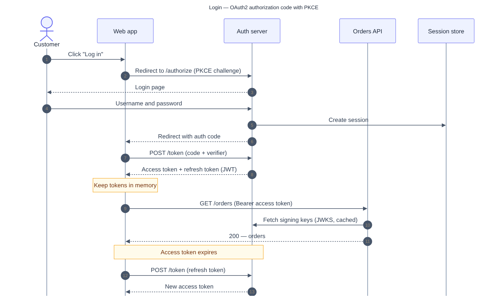

# Examples

Two diagrams built with this plugin, showing the split it makes: **Mermaid for
flows, draw.io for architecture.**

## Auth flow — Mermaid

An OAuth2 authorization-code + PKCE login as a sequence diagram.

- [`auth-flow.mmd`](auth-flow.mmd) — the source
- [`auth-flow.svg`](auth-flow.svg) — vector render · [`auth-flow.png`](auth-flow.png) — raster



Reproduce:

```sh
mmdc -i auth-flow.mmd -o auth-flow.svg -c ../assets/mermaid/config.light.json
```

## Data platform — draw.io

A data-engineering platform (sources → ingestion → processing → storage → serving),
laid out by **draw.io's own engine** and animated on its flow edges.

- [`data-platform.model.json`](data-platform.model.json) — the input model
- [`data-platform.drawio`](data-platform.drawio) — editable, draw.io's layout baked in
- [`data-platform.svg`](data-platform.svg) — animated vector (open in a browser)
- [`data-platform.gif`](data-platform.gif) — animated preview


Reproduce (the `/diagram` command orchestrates these, including icon resolution):

```sh
node ../scripts/fetch-icon.mjs <slug> ...          # resolve each node's tech icon
node ../scripts/mermaid-to-drawio.mjs data-platform.model.json raw.drawio
../scripts/export-drawio.sh raw.drawio data-platform.drawio --layout horizontalFlow
../scripts/export-drawio.sh raw.drawio data-platform.svg     --layout horizontalFlow
```

The `data`/`async` edges carry draw.io's flow animation, which the `.svg`/`.gif`
preserve; a `.jpeg`/`.png` would freeze a single frame.
