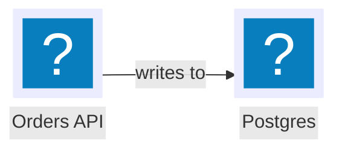

# Mermaid style and syntax reference

Everything the mermaid-diagrams skill needs beyond the short recipe: exact grammar, palettes,
and render commands. Mermaid v11+ throughout; `architecture-beta` needs v11.1+, flowchart icon
nodes v11.3+, `align` v11.16+.

## architecture-beta grammar


- `group id(icon)[Label]` declares a container; `in parentId` nests it.
- `service id(icon)[Label] in groupId` declares a node. `junction id` is an invisible routing point.
- Edge syntax `a:SIDE ARROW SIDE:b` — sides are `L`, `R`, `T`, `B` and set the ports, which is how
  you get straight, aligned runs. Arrows: `--` (line), `-->` (arrow), `<-->` (both ends).
  There is no dashed variant; put "async" in the label instead.
- An edge crossing a group border must mark the crossing endpoint with `{group}`:
  `api:R --> L:ext{group}`.
- `align row a b c` / `align column a b` pins services onto one rank (v11.16+).
- Built-in icons: `cloud`, `database`, `disk`, `internet`, `server`. Everything else comes from
  icon packs.

## Icon packs

Reference pack icons as `pack:name`, e.g. `logos:aws-ec2`, `logos:kafka`, `devicon:redis`.
Search ids at https://icones.js.org. Safe-to-use packs: `@iconify-json/logos` (colored brand
marks, CC0/MIT), `@iconify-json/devicon` (MIT).

- CLI (mmdc): `--iconPacks @iconify-json/logos --iconPacks @iconify-json/devicon` — the render
  script passes these already.
- Browser / bundler:

```js
mermaid.registerIconPacks([
  { name: "logos", loader: () => import("@iconify-json/logos").then((m) => m.icons) },
  { name: "devicon", loader: () => import("@iconify-json/devicon").then((m) => m.icons) },
]);
```

## Flowchart icon nodes (v11.3+)



`form` is `square`, `circle`, or `rounded`; `pos` places the label (`t`/`b`); `h` is icon height
in pixels. Icon nodes ignore `classDef` fills, so lean on the label and edge styling around them.

## Frontmatter config block

Every `.mmd` should open with YAML frontmatter so it renders correctly outside our CLI too.
Frontmatter wins over the `-c` config file, so keep both in sync (copy from the asset configs).

```yaml
---
title: Checkout flow — container view
config:
  theme: base
  look: classic
  layout: elk
  themeVariables:
    background: "#ffffff"
    primaryColor: "#eef2ff"
    primaryTextColor: "#1e293b"
    primaryBorderColor: "#6366f1"
    lineColor: "#64748b"
    fontFamily: "Inter, Helvetica Neue, Arial, sans-serif"
  flowchart:
    nodeSpacing: 50
    rankSpacing: 70
---
```

`layout: elk` gives orthogonal, crossing-minimized routing; mmdc ships the ELK engine. For a
reproducible sketch look use `look: handDrawn` with `handDrawnSeed: 7` — default stays `classic`.

## Theme palettes (hex only — themeVariables reject named colors)

Light — clean slate and indigo on white:

| Variable | Value | | Variable | Value |
|---|---|---|---|---|
| `background` | `#ffffff` | | `lineColor` | `#64748b` |
| `primaryColor` | `#eef2ff` | | `textColor` | `#1e293b` |
| `primaryTextColor` | `#1e293b` | | `clusterBkg` | `#f8fafc` |
| `primaryBorderColor` | `#6366f1` | | `clusterBorder` | `#cbd5e1` |
| `secondaryColor` | `#f1f5f9` | | `edgeLabelBackground` | `#ffffff` |
| `tertiaryColor` | `#f8fafc` | | `noteBkgColor` | `#fffbeb` |

Dark — slate-900 canvas, legible text, brighter strokes:

| Variable | Value | | Variable | Value |
|---|---|---|---|---|
| `background` | `#0f172a` | | `lineColor` | `#94a3b8` |
| `primaryColor` | `#1e293b` | | `textColor` | `#e2e8f0` |
| `primaryTextColor` | `#e2e8f0` | | `clusterBkg` | `#1e293b` |
| `primaryBorderColor` | `#818cf8` | | `clusterBorder` | `#475569` |
| `secondaryColor` | `#334155` | | `edgeLabelBackground` | `#0f172a` |
| `tertiaryColor` | `#0f172a` | | `noteBkgColor` | `#422006` |

The full variable sets (sequence actors, notes, ER attribute rows) live in
`assets/mermaid/config.light.json` and `config.dark.json` — copy from there rather than
retyping.

## Role classDefs (flowchart, state)

`classDef` applies to flowcharts and state diagrams; architecture-beta and C4 take their colors
from themeVariables only. One classDef per model role, then one `class` line per role:

```mermaid
classDef service fill:#eef2ff,stroke:#6366f1,color:#1e293b
classDef datastore fill:#ecfdf5,stroke:#10b981,color:#064e3b
classDef queue fill:#fffbeb,stroke:#f59e0b,color:#78350f
classDef cache fill:#fff1f2,stroke:#f43f5e,color:#881337
classDef gateway fill:#f0f9ff,stroke:#0ea5e9,color:#0c4a6e
classDef external fill:#f8fafc,stroke:#94a3b8,color:#334155,stroke-dasharray:4 3
classDef actor fill:#f5f5f4,stroke:#78716c,color:#292524
classDef client fill:#f0fdfa,stroke:#14b8a6,color:#134e4a
classDef job fill:#f7fee7,stroke:#84cc16,color:#365314

class api,billing service
class db,ledger datastore
```

Dark-theme variant: keep the stroke hues but lighten them one step and use dark fills —
`fill:#1e293b` with strokes `#818cf8` (service), `#34d399` (datastore), `#fbbf24` (queue),
`#fb7185` (cache), `#38bdf8` (gateway), `#94a3b8` (external, dashed), `#a8a29e` (actor),
`#2dd4bf` (client), `#a3e635` (job), and `color:#e2e8f0` on all of them.

## Edges and labels

- Edge labels: `a -->|"writes to"| b` (flowchart), `a:R --> L:b` has no label slot in
  architecture-beta — keep those edges self-evident or fold the verb into node labels.
- Kind mapping in flowcharts: sync `-->`, async `-.->`, data `---`, bidirectional `<-->`.
- Backtick-markdown labels support bold/italic and auto-wrap long text:
  ``db["`**Postgres 16**\norders, payments, ledger`"]``.
- Keep labels sentence case and short; a diagram is not the place for a paragraph.

## Config JSON shape (the `-c` file)

```json
{
  "theme": "base",
  "look": "classic",
  "layout": "elk",
  "themeVariables": { "primaryColor": "#eef2ff", "...": "..." },
  "flowchart": { "nodeSpacing": 50, "rankSpacing": 70 },
  "iconPacks": ["@iconify-json/logos", "@iconify-json/devicon"]
}
```

## Rendering with mmdc

```bash
npm i -g @mermaid-js/mermaid-cli   # provides mmdc

# vector
mmdc -i diagram.mmd -o diagram.svg -c config.light.json \
  --iconPacks @iconify-json/logos --iconPacks @iconify-json/devicon

# raster, 3x scale, explicit background (JPEG has no alpha)
mmdc -i diagram.mmd -o diagram.png -s 3 -b '#ffffff' -c config.light.json \
  --iconPacks @iconify-json/logos --iconPacks @iconify-json/devicon
```

mmdc cannot emit JPEG. Render PNG (or SVG) and convert:
`magick diagram.png -quality 92 diagram.jpeg` (ImageMagick) or sharp
(`sharp(png).jpeg({ quality: 92 }).toFile(jpeg)`). `scripts/render-mermaid.mjs` wraps this whole
chain.

When running as root or in CI, Chromium needs a puppeteer config passed with `-p`:

```json
{ "args": ["--no-sandbox", "--disable-setuid-sandbox"] }
```

The render script writes this file to a temp directory on every run, so you only need it when
calling mmdc by hand.
